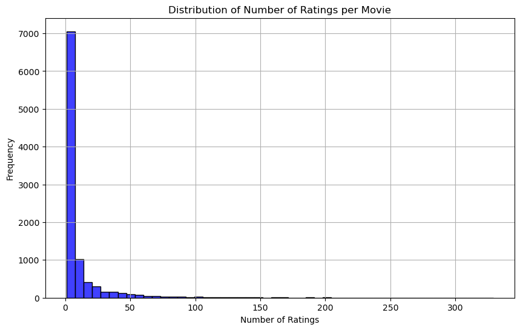
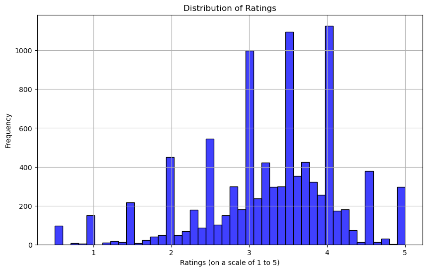
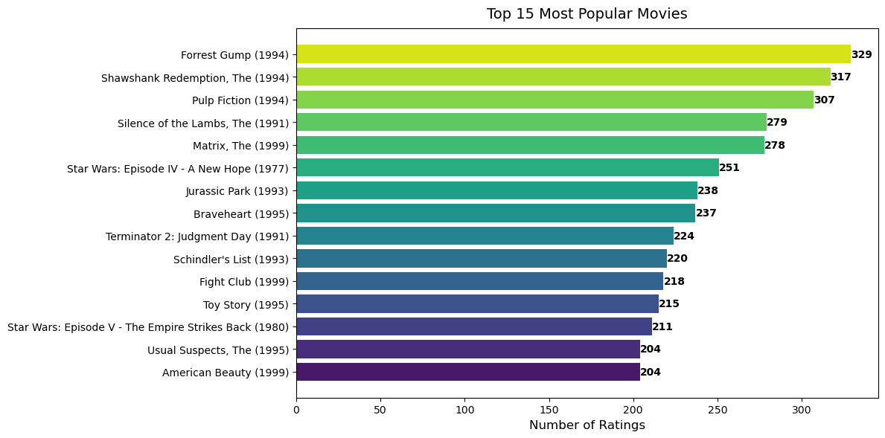
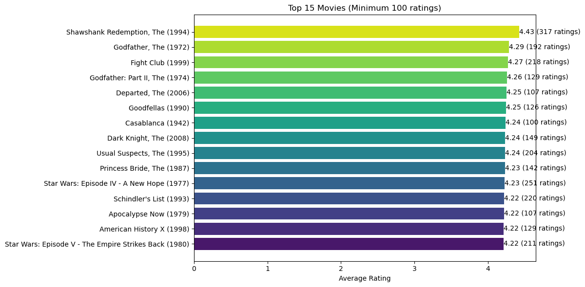

# Movie Recommendation System

## Summary

In this project, we used the MovieLens dataset, which includes 100,836 user ratings from 610 users, averaging 3.5 out of 5. This dataset is ideal for building a recommendation system, leveraging both collaborative and content-based filtering.

Data preparation involved handling missing values and formatting for analysis using Pandas, while Scikit-Learn and Keras were used for preprocessing. For visualization, we utilized Seaborn and Matplotlib.

For modeling, we applied Surprise for collaborative filtering and explored various metrics. Additionally, we built a neural network with TensorFlow and Keras, incorporating embedding layers and techniques to prevent overfitting.

Model validation was conducted using cross-validation, and the final model achieved a Root Mean Squared Error (RMSE) of 0.869, indicating effective personalized movie suggestions. We employed an 80-20 train-test split for performance validation.

## Overview

This project aims to develop a recommendation system that provides personalized movie recommendations based on user ratings. Utilizing the [MovieLens dataset](https://web.archive.org/web/20240828133414/https://grouplens.org/datasets/movielens/latest/) from the GroupLens research lab at the University of Minnesota, the model will be trained on a subset of the dataset containing 100,000 user ratings.

This system can be valuable for streaming platforms and movie enthusiasts, offering tailored movie suggestions to enhance user experience and engagement.The project will involve several steps, including data cleaning, exploratory data analysis, feature engineering, model selection, and evaluation.

Throughout this project, we will also explore the relationships between different variables and their impact on movie recommendations. This will help us gain insights into user preferences and identify potential areas for improvement. Overall, this project has the potential to provide valuable insights and practical applications for the entertainment industry. By developing a recommendation system that can accurately suggest movies, streaming platforms can better engage their users, improve customer satisfaction, and increase viewership.

## Business Understanding

The entertainment industry, especially streaming platforms, is fiercely competitive, with a constant need to enhance user engagement and satisfaction. A key challenge is delivering personalized content recommendations to reduce churn rates.

Personalized recommendations can significantly boost user engagement and retention. Therefore, a robust recommendation system is essential for suggesting movies based on user preferences. By providing tailored movie suggestions, streaming platforms can create a better viewing experience.

The project's business value lies in improving content recommendation strategies, increasing user satisfaction, and reducing churn. An effective recommendation system can enhance user engagement, leading to higher viewership and subscription renewals, thus providing a competitive edge and driving revenue growth.

## Data Understanding

The data used in this project is the [MovieLens dataset](https://files.grouplens.org/datasets/movielens/ml-latest-small.zip) from the GroupLens research lab, containing 100,000 user ratings. It includes three main files:

- `movies.csv`: Contains movie details such as unique identifiers, titles (with release years), and genres.

- `ratings.csv`: Captures user ratings, including user IDs, movie IDs, rating values (1 to 5), and timestamps.

- `tags.csv`: Records user-generated tags for movies, featuring user IDs, movie IDs, tags, and timestamps.

The `movieId` is consistent across all files, while `userId` is consistent between the ratings and tags files. This structure facilitates effective analysis for the recommendation system.

From the graph above, we can see that the distribution of the number of ratings per movie is rightly skewed. This implies that majority of the movies have less than 50 ratings with a few having above 100 ratings for a single movie. 50% of the movies have fewer than 50 ratings.

Around 49% of movies receive ratings between 3 and 4. This implies that most movies receive above average ratings and fewer movies receive extremely low or high ratings.

In the graph above, we plot the 15 most popular movies by number of ratings.

In the graph above, we plot the 15 highest rated movies. The movies shown all have at least 100 ratings.

## Modeling Process

The modeling process involved developing and evaluating seven different models to recommend movies based on user ratings. The models ranged from basic collaborative filtering approaches to more advanced techniques such as matrix factorization and neural networks.

- Baseline Model: We used a  simple KNN-based model using cosine similarity to assess user similarity.

- Pearson Similarity Model: A variant of the KNN model that uses Pearson correlation for user similarity.

- KNN with Means: This model uses KNN while adjusting for average ratings, aiming to improve predictions.

- KNN Baseline: Similar to the baseline model but incorporates user and item biases.

- SVD Model: A matrix factorization technique was used to capture latent factors influencing user ratings.

- Hyperparameter Tuning: We fine-tuned the SVD model using grid search to identify optimal hyperparameters, enhancing performance.

- Neural Network: We developed a deep learning approach using user and movie embeddings, consisting of several dense layers to predict ratings based on interactions.

## Model Performance and Hyperparameters

1. Baseline Model: Achieved an RMSE of 0.9736 using cosine similarity.

2. Pearson Similarity Model: Achieved an RMSE of 0.9742, slightly worse than the baseline, indicating that cosine similarity may be more effective in this context.

3. KNN with Means: Improved performance with an RMSE of 0.9017, suggesting that accounting for average ratings helps enhance predictions.

4. KNN Baseline: Further improved with an RMSE of 0.8792, showing the value of incorporating user and item biases.

5. SVD Model: Achieved an RMSE of 0.8732, demonstrating the effectiveness of matrix factorization in capturing underlying patterns.

6. Hyperparameter Tuning (SVD): The best model obtained through grid search yielded an RMSE of 0.8693. Key hyperparameters included:

    - n_factors: 50, 100, 150
    - reg_all: 0.02, 0.05, 0.1

7. Neural Network: This model resulted in an RMSE of 0.8876. Notable aspects of the this included:

    - Embedding dimensions: 50
    - Dense layers: Two hidden layers with 128 and 64 neurons, respectively.
    - Dropout rates: 0.5 to prevent overfitting.
    - Optimizer: Adam with a learning rate of 0.0001.

Overall, the models showed a clear progression in performance, with hyperparameter tuning of the SVD model yielding the best results, demonstrating the importance of optimization in collaborative filtering tasks.
